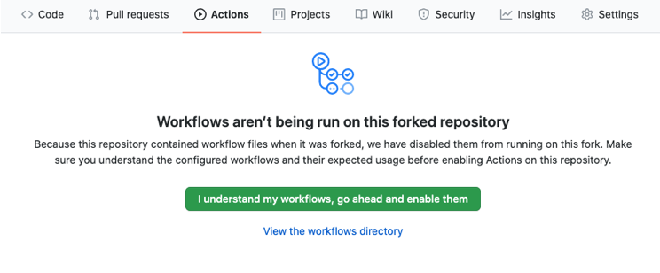
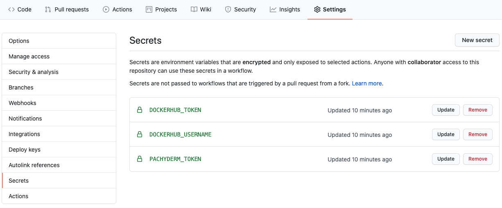

# Github Actions Example

GitHub Actions are a useful way to build and push your code. With the Pachyderm GitHub Action, you can automatically update a pipeline(s) when your code is committed. 

In this example, we'll take the [Housing Prices Example](https://github.com/pachyderm/pachyderm/tree/example/housing-prices/examples/ml/housing-prices) and add a GitHub Action for it. 


- [Overview](#overview)
- [Getting Started](#getting-started)
- [Customizing this Project](#customizing-this-project)
  - [Use the GitHub Action in Your Project](#use-the-github-action-in-your-project)
  - [Optional Configuration](#optional-configuration)
- [Generating the Pachyderm Authentication Token](#generating-the-pachyderm-authentication-token)
- [Using this Example in Production](#using-this-example-in-production)

## Overview

This project builds a Docker image used by multiple pipelines every time code is committed and pushed to the repo. We assume that you already have a Pachyderm cluster up and running that is accessible over the internet (GitHub will be pushing to your cluster). The GitHub Action in this repository will:

1. Build and tag the Docker image for the Pachyderm Pipeline
2. Push the image to the Docker Registry (Docker Hub)
3. Build a Docker image that can communicate with the running Pachyderm cluster
4. Update the pipeline with the image built in (1)

  Note: The GitHub action updates or creates the pipeline, but does not create or delete data repositories. Any input repositories should already exist or the pipeline cannot be created.

## Getting Started

Forking this repository is the easiest way to get started. It will copy the repository into your own account and allow you to set your access credentials via secrets through GitHub. You can fork your own copy of this repo by clicking the button in the upper right corner of GitHub.

Once the repo is forked, you will need to enable GitHub actions in your forked version by selecting the "Actions" tab on GitHub and enabling them.

<p align="center">
  
</p>

Once this is enabled, Actions are ready to run, but need to be configured to point to your Pachyderm cluster. The [GitHub Action workflow](./.github/workflows/push.yaml) is responsible for performing each step. We will need to configure this for our Pachyderm cluster and Docker Hub. 

There are three items in [`push.yaml`](./.github/workflows/push.yaml) that need to be configured for the action to function.

1.  `PACHYDERM_CLUSTER_URL`: This is the url to your pachyderm cluster, the one configured via Ingress to `pachd`'s GRPC port.
  If you use Pachyderm Hub, it'll look something like `grpcs://hub-some-id.clusters.pachyderm.io:31400`.
2. `DOCKER_IMAGE_TAG`: Replace this with the base repo/tag combination for the Docker registry to which your image will be pushed.
  For this demo, it's set to `pachyderm/housing-prices`
3. `PACHYDERM_PIPELINE_FILES`: A space-delimited list of pipeline specifications that depend on `DOCKER_IMAGE_TAG`.
  In this project, there's just one pipeline, `regression.json`.

GitHub Repository Secrets are used to keep your access credentials secure while giving permissions to build and run a pipeline, preventing any private information from being exposed in your code. You can create a secret by going into the "Settings" for your repository and selecting "Secrets" from the sidebar. For more information, see [creating and using secrets in a GitHub Workflow](https://docs.github.com/en/actions/configuring-and-managing-workflows/creating-and-storing-encrypted-secrets). We will create three Secrets: `PACHYDERM_TOKEN`, `DOCKERHUB_TOKEN`, and `DOCKERHUB_USERNAME`.

1. `PACHYDERM_TOKEN`: This is an authentication token to access the Pachyderm cluster. You can generate it using `pachctl auth get-auth-token --ttl <some duration>`. For information on setting the `--ttl` duration, see [generating the Pachyderm authentication token](#generating-the-pachyderm-authentication-token) below.
2. `DOCKERHUB_TOKEN` and `DOCKERHUB_USERNAME`: for GitHub to be able to push the Docker image once it is built. For information on creating a Docker Hub token, see [Managing Access Tokens](https://docs.docker.com/docker-hub/access-tokens/).
  
Once created, your secrets should look like the image below:

<p align="center">
  
</p>

Once these changes are committed, the GitHub Actions will be executed with each commit (including the commit with the changes to `push.yaml`).

The status and results of Actions can be monitored under the "Actions" tab.

## Customizing this Project

You can also use this repository as a template for your own project. The [workflow](./.github/workflows/push.yaml) controls the tasks to be executed for the GitHub action and [pachyderm-github-action](./pachyderm-github-action) tells the action how and what to communicate with Pachyderm. The 4 stages in the workflow are:

1. Log into DockerHub using the GitHub secrets, `DOCKERHUB_TOKEN` and `DOCKERHUB_USERNAME`.
2. Build the Docker image used by the pipelines.
3. Push the Docker image to DockerHub with a tag defined by the git commit for the code in the pipeline.
  In this project, the tag will be something like `pachyderm/housing-prices:28478808dc24124aec77f1df3d52f132beeb6847`
4. Push an updated pipeline spec to your Pachyderm cluster.
  This step uses the GitHub secret `PACHYDERM_TOKEN` to gain access to the cluster.
  It also uses the custom action defined in the directory [pachyderm-github-action](./pachyderm-github-action).
  A common practice in production is to put custom actions in the `.github` directory.
  It was placed in a non-hidden directory so you can more easily see the code
  to modify it for your own purposes.

### Use the GitHub Action in Your Project

1. Copy the [`.github`](./.github) and [`pachyderm-github-action`](./pachyderm-github-action) to your own project.

2. Customize the environment variables for your project: `PACHYDERM_CLUSTER_URL`, `PACHYDERM_TOKEN`, `PACHYDERM_PIPELINE_FILES`, `DOCKER_IMAGE_TAG`, `DOCKERHUB_TOKEN` and `DOCKERHUB_USERNAME`. See [Getting Started](#getting-started) for more details on these.
     
### Optional Configuration

1. (Optional) You may move the directory `pachyderm-github-action` into the `.github` directory
   if you want to package all the actions together.
   You will need to modify the final step of the `Docker Images CI` workflow to reflect the new path, something like:
   ```bash
   - name: pachyderm-update-pipelines
     uses: .github/pachyderm-github-action
     id: pup
   ```
  
2. (Optional) You may want to create shared workflows or add additional actions.
   Please consult the [Documentation on GitHub Actions](https://docs.github.com/en/actions) for more information.

## Generating the Pachyderm Authentication Token

Once Pachyderm access controls are activated,
login as the user with permissions to update the pipelines for your DAG.

You may want to test this with the `robot:admin`
configured when access controls were activated,
or your own credentials.
Please see [Using this example in production](#using_this_example_in_production) below
for information regarding production-level security configuration.

Create a Pachyderm authentication token by running the following command:

```bash
pachctl auth get-auth-token --ttl <some-golang-formatted-duration>
```

A golang-formatted duration uses `h` for hours, `m` for minutes, `s` for seconds.
26 weeks would be `24 * 7 * 26` hours, 
expressed as `624h`. 
The token will only be generated for this duration
if it is *shorter* than the lifetime of the session
for the user who is logged into the cluster
where the command is run. 
Otherwise, it is generated for the duration of that user's current session.
The expiration of a user's current session can be determined
by running `pachctl auth whomai`.

The duration of the token 
determines how long the cron pipeline may run 
before the secret needs to be refreshed 
and the pipeline restarted.

Here is a Unix command 
for generating a token using `pachctl`
and only outputting the value of the token:

```bash
pachctl auth get-auth-token --ttl "624h" | \
    grep Token | awk '{print $2}'
```

The command is enhanced to encode the token with the `base64` encoding scheme,
so it can be used in a Kubernetes secret,
and trim off unnecessary characters.

```
pachctl auth get-auth-token --ttl "624h" | \
    grep Token | awk '{print $2}' | \
    base64 -e | tr -d '\r\n'
```

## Using this Example in Production

We recommend that this example be used in production with Pachyderm access controls activated.

When you implement this example on production pipelines with access controls activated,
you may have to periodically renew `PACHYDERM_TOKEN` in your GitHub repo,
depending on how your identity provider is configured.

It is a best security practice in production
to create a Pachyderm user 
with the [least privilege](https://en.wikipedia.org/wiki/Principle_of_least_privilege) required to do this pipeline's tasks.

This is a periodic maintenance task
with security implications
the automation of which should be reviewed
by appropriate engineering personnel.
